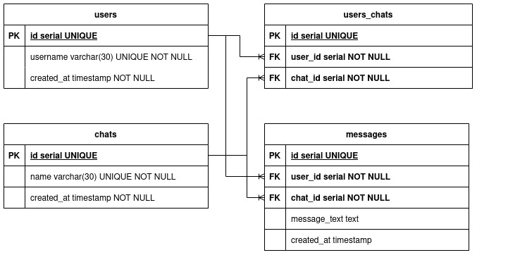

<h1 align="center">  Avito.tech's task for backend trainee (2020 year) </h1>

  
  
  
  

## Navigation

* [Project description](#chapter-0)
* [API](#chapter-1)
* [Quick start](#chapter-2)
* [Source code](#chapter-3)
* [License](#chapter-4)

## :page_facing_up: Project description

Based on **[technical specification (RU)](./docs/technical_specification_ru.md)**.

A chat server that provides an HTTP API for working with user chats and messages.

### Entities

#### User

Application user. It has the following properties:

- **id** *int* - unique user ID
- **username** *string* - unique user name
- **created_at** *datetime* - user creation time

#### Chat

A separate chat. It has the following properties:

- **id** *int* - unique chat ID
- **name** *string* - unique chat name
- **users** *list[User]* - list of users in the chat (a many-to-many relationship)
- **created_at** *datetime* - chat creation time

#### Message

A message in the chat. It has the following properties:

- **id** *int* - unique message ID
- **chat** *int* - link to the ID of the chat to which the message was sent
- **author** *int* - a link to the sender ID of the message (a many-to-one relationship)
- **text** *string* - the text of the sent message
- **created_at** *datetime* - message creation time

### Database schema

Original: [database-schema.drawio](./docs/database-schema.drawio)

## :pushpin: API

:heavy_exclamation_mark: This API **does not** satisfy the RESTful API Best Practice.

The URLs were specified in the [technical specification](./docs/technical_specification_ru.md).

See the OpenAPI Specification in:

- [`docs/swagger.json`](./docs/swagger.json)
- [`docs/swagger.yaml`](./docs/swagger.yaml)

[Open API Specification file Visualization](https://editor.swagger.io)

After launching the service, you can use the Swagger UI
at [`http://127.0.0.1:9000/swagger/index.html`](http://127.0.0.1:9000/swagger/index.html).

## :zap: Quick start

- [ ] Make commands

## :computer: Source code

The project structure is based on [go-clean-template](https://github.com/evrone/go-clean-template).

### Config

The configuration structure is described in [`config/config.go`](./config/config.go).
Parameter values are set in the [`config/config.yaml`](./config/config.yaml) and in the environment variables.

### Technologies

- DBMS: **PostgreSQL**
- Programming language: **Go (1.19.4)**
- Frameworks and libraries:
    - [`gin`](https://github.com/gin-gonic/gin) - HTTP web framework
    - [`pgx`](https://github.com/jackc/pgx) - PostgreSQL driver and toolkit
    - [`swag`](https://github.com/swaggo/swag) - Automatically generate RESTful API documentation with Swagger 2.0
    - [`cleanenv`](http://github.com/ilyakaznacheev/cleanenv) - Clean and minimalistic environment configuration reader
    - [`zerolog`](https://github.com/rs/zerolog) - Zero Allocation JSON Logger
    - [ ] Other libs
- Tools
    - **Docker** and **Docker compose**
    - **`make`**

### Tests

- [ ] End-to-end tests

## :open_hands: License

Author: [Yu-Leo](https://github.com/Yu-Leo)

License: [GNU General Public License v3.0](./LICENSE)

If you use my code, please put a star ⭐️ on the repository.
